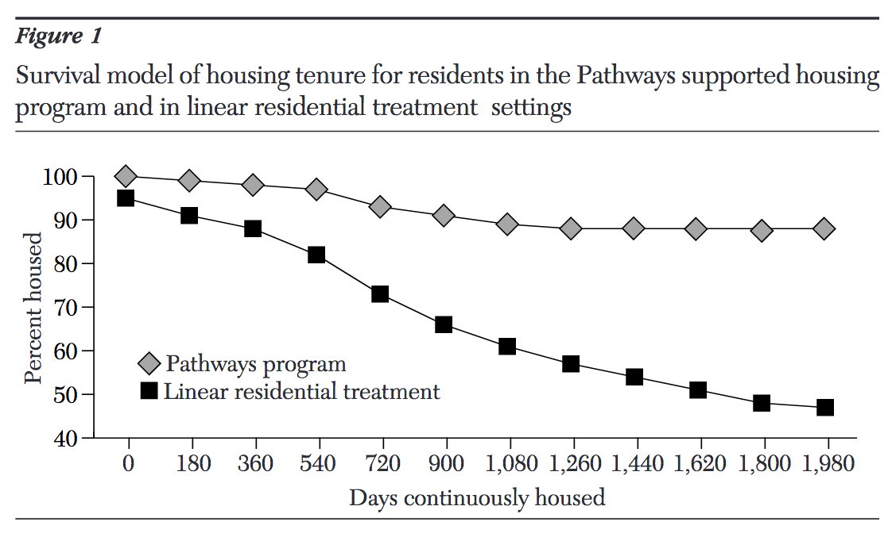
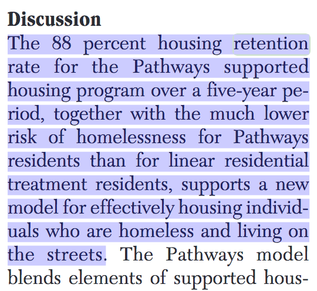

THOUGHTS AND PERSPECTIVES ON PSH FROM THE GROUND
========================================================
author: Robert Mitchell | @robertmitchellv
date: 2018-09-04
autosize: true
css: ../custom.css

bash-3.2$ whoami
========================================================
incremental: true

***

+ I work at Skid Row Housing Trust as a data analyst
+ (I'll just refer to it as SRHT from now on)
+ I have been working in this role for around three years
+ I am self taught as a programmer/analyst
+ Background in philosophy, comp lit, french, information science

A BIT ABOUT SRHT
========================================================
incremental: true

***

+ We do three things:
  1. ~~Develop affordable housing; specifically permanent supportive housing~~
  2. ~~Provide supportive services to the residents of our affordable housing projects~~
  3. ~~Have an affiliate manage the properties, repairs, et cetera~~

A BIT ABOUT SRHT
========================================================
incremental: true

***

+ We believe in the Housing First model
+ We believe in Harm Reduction
+ This is pretty much industry standard for the most part

WHAT I WANT TO COVER
========================================================
incremental: true

+ Research ➡️ policy threshold ➡️ providerspace feedback loop
+ Building in measurement when there was none
  * And the data infrastructure associated with this effort
+ Current work and the direction SRHT is going in connection to data

WHY TALK ABOUT THIS FEEDBACK LOOP?
========================================================
incremental: true

+ It reflects a frustration that many providers feel
+ It may not be something that is necessarily shared often and connects to the kind of policy advocacy SRHT would like to be a part of in the future

DEMONSTRATION STUDIES
========================================================
incremental: true

+ Pathways to Housing: Supported
Housing for Street-Dwelling Homeless
Individuals With Psychiatric Disabilities (Tsemberis, 2000)
  * Most HF people are familiar with this study, it's _widely_ used to justify HF, which the providerspace is behind
  * These survival figures help us advocate for HF

***

DEMONSTRATION STUDIES
========================================================
incremental: true

+ But then we see this retention figure
  * On the one hand, this shows HF efficacy
  * On the other hand, will this be the bar providers are held to?
  
***

SHAPING PUBLIC OPINION
========================================================
incremental: true

 

SHAPING PUBLIC OPINION
========================================================
incremental: true

 

APPLES TO APPLES?
========================================================
incremental: true

+ Is New York like Los Angeles?
+ Is Utah like Los Angeles?
+ How does this shape public opinion?

IS THIS A GOOD MEASURE?
========================================================
incremental: true

+ 🙅‍♀️
+ I don't think this is a good measure since it says nothing of provider effort or _quality_
  * It's effectively housing _churn_ until there is a uniform retention calculation that controls for success and can also control for effort on the side of the provider

WHAT DATA DID I INHERIT?
========================================================
incremental: true

+ Lots of tables of things; nothing that is connected by keys or can be aggregated meaningfully
+ Data that is lost on paper somewhere or in excel in a lonely, forgotten directory
+ 💡 are there mandatory reports required through some compliance function?
  + ~~Is this even useful? What does it communicate?~~
  + ~~Yeah you HUD mandated Annual Progress Report (APR) 👀~~
+ Is there research literature? What is cited in those studies?
  + ~~Are there comparisons to draw? Can you chase the citations?~~

BUILDING MEASUREMENT
========================================================
incremental: true

+ There were no measurements--nothing that I could use to demonstrate change in housing over time in a way that could be abstracted to an aggregate level meaningfully
+ I didn't have the _right_ kind of data to demonstrate good __outcomes__

***

BUT WHAT ARE OUTCOMES?
========================================================
incremental: true

+ Please no eye-rolling for this slide 🙄
+ This word takes on a different meaning in the provider space
+ For many the meaning is:
  
> We need to show funders that we are effective--we need to figure out how to demonstrate this with data

RETURNING TO THE FEEDBACK LOOP
========================================================
incremental: true

***

+ Providers worry about data they share because it can affect funding
+ If policy thresholds are set via demonstration studies, has anyone asked:
  * Is this realistic for CoCs and providers?
    * Did a replica of this model scale in the real world?
    * Does this model fit for our CoC?
  * Is the study an apples to apples comparison? E.g., funding, population, weather, et cetera.
  * Does this conscript providers to succeed _a priori_ or lose funding?

HOW DOES A PROVIDER BREAK FREE?
========================================================
incremental: true

***

+ Collect our own data
+ Use validated research instruments (don't reinvent the wheel)
+ Think descriptive not prescriptive
+ Have no agenda
+ Observe what actually happens in PSH

WHY DO I THINK THIS WILL WORK?
========================================================
incremental: true

+ Unless providers are able to take part in helping to shape the narrative around expectation setting for PSH, we will continue to be a step behind unable to risk losing funding
+ Since we don't have something we are trying to prove, we can just observe our residents and gain insight into how they chance while in PSH
+ When we use data rather than anecdote, we hope our perspective will carry more weight

WHAT WE ARE USING CURRENTLY
========================================================
incremental: true

+ World Health Organization Disability Assessment Schedule 2.0
+ Modified Colorado Symptom Index
+ Patient Health Questionnaire
+ Generalized Anxiety Disorder
+ Hospital Social Functioning Questionnaire

***

+ PTSD Checklist (Civilian)
+ Slapped, Threatened, and Throw
+ Hurt, Insulted, Threatened with Harm, and Screamed
+ Suicide Behaviors Questionnaire-Revised
+ Alcohol Use Disorders Identification Test
+ Drug Abuse Screening Test

HOW OFTEN DO WE COLLECT DATA?
========================================================
incremental: true

+ We conduct a longer survey at move in and follow-ups every six months
+ We are working toward full coverage of all residents but this is difficult since there are so many different funding sources for our affordable housing projects
  * Maintaining uniformity across our portfolio is no small task, but it's a value of ours

Data infrastructure
========================================================
incremental: true

+ This was a long process since it involved getting rid of vendors that were taking advantage of us
+ Reorienting folks to the fact that we can do a lot with code and open source projects
+ That building these tools out is not as scary as it sounds

***

WHAT AM I WORKING ON?
========================================================
incremental: true

+ A logistic regression model to predict negative exits from housing
  * The 💡 is that homelessness recidivism will be an important area of study soon
+ A generalized linear mixed effects model for individual change in housing
  * So that we can learn what an average trajectory even looks like
+ Automated case plan triage
  * Based on our assessment, put together an individualized case plan based on response data

Thank You!
========================================================
incremental: true

# 🙏
### ~~Questions?~~

