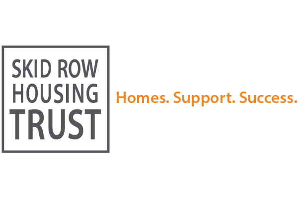

INTERACTIVE DASHBOARDS WITH SHINY
========================================================
author: Robert Mitchell | @robertmitchellv
date: 2018-12-10
autosize: true
css: ../custom.css


ABOUT ME
========================================================
incremental: true



***

+ I work at Skid Row Housing Trust as a data analyst
+ (I'll just refer to it as SRHT from now on)
+ I have been working in this role for around three years
+ I am self taught as a programmer/analyst
+ Background in philosophy, comp lit, french, information science


A BIT ABOUT SRHT
========================================================
incremental: true


***

+ We do three things:
  1. Develop affordable housing; specifically permanent supportive housing
  2. Provide supportive services to the residents of our affordable housing projects
  3. Have an affiliate manage the properties, repairs, et cetera


A BIT ABOUT SRHT
========================================================
incremental: true


***

+ We believe in the Housing First model
+ We believe in Harm Reduction
+ This is pretty much industry standard for the most part


WHAT I WANT TO COVER
========================================================
incremental: true

+ UI ➡️ server ➡️ user feedback loop
+ The different ways your `shiny` app can _be_ interactive
+ The different ways your `shiny` app can _look_
  * The libraries associated with these efforts
+ How you can dip your toe into this kind work if phrases like __deploy my application__ are scary using `flexdashboard` instead of `shiny`
+ _Briefly_ touch on the improvements to the `shiny` framework, e.g., `async` and how you can make it scale (things to think about for later)

WHO THIS TALK IS FOR
========================================================
incremental: true

+ People who have been learning R for a little while and are curious about they can put their work online
+ You've maybe done a `shiny` tutorial before but didn't finish it

***T 


WHO THIS TALK IS FOR
========================================================
incremental: true


***

+ You're eager to learn how some of this works but may not have time to put it to use yet
+ You're really just dipping your toe into this and want to get an idea into how it works

WHAT I HOPE FOR YOU AFTER
========================================================
incremental: true

+ It's ok if you walk away from this still not sure how you're going to build your `shiny` application--writing code is hard and you should know it takes non-software engineers a while to wrap their minds around things like this
+ This is definitely my experience

***


WHAT I HOPE FOR YOU AFTER
========================================================
incremental: true


***

+ The confidence to go home, read through some documentation and just try to start putting things together!
+ You won't learn until you try!


WHY SHINY?
========================================================
incremental: true

<br>
<center>

</center>


WHY SHINY?
========================================================
incremental: true

+ You can leverage the work you have already done in R to accomplish something you would normally need to learn JavaScript, Ruby, Python, PHP, or something else to accomplish
+ The same way that you would create a visualization for an `rmarkdown` report can be repurposed for another medium
  * This is _especially_ true of `flexdashboard`, which you should _always_ use in the event a `shiny` application is unnecessarily adding complexity to your work! (we'll talk about this more later)


FEEDBACK LOOP?
========================================================
incremental: true

+ I'm talking about the ways in which your user _clicks_ and explores your dashboard's __user interface__ (UI)
+ Which then _triggers_ code in your `server` code to run
+ Which then _returns_ __output__ back to your __input__
+ So your user can get what they need

***


HOW DOES THIS WORK?
========================================================
incremental: true

<br>
<center>
The magic behind this is _reactivity_ <svg style="height:0.8em;top:.04em;position:relative;" viewBox="0 0 512 512"><path d="M101.1 505L7 410.9c-9.4-9.4-9.4-24.6 0-33.9L377 7c9.4-9.4 24.6-9.4 33.9 0l94.1 94.1c9.4 9.4 9.4 24.6 0 33.9L135 505c-9.3 9.3-24.5 9.3-33.9 0zM304 159.2l48.8 48.8 89.9-89.9-48.8-48.8-89.9 89.9zM138.9 39.3l-11.7 23.8-26.2 3.8c-4.7.7-6.6 6.5-3.2 9.8l19 18.5-4.5 26.1c-.8 4.7 4.1 8.3 8.3 6.1L144 115l23.4 12.3c4.2 2.2 9.1-1.4 8.3-6.1l-4.5-26.1 19-18.5c3.4-3.3 1.5-9.1-3.2-9.8L160.8 63l-11.7-23.8c-2-4.1-8.1-4.1-10.2.1zm97.7-20.7l-7.8 15.8-17.5 2.6c-3.1.5-4.4 4.3-2.1 6.5l12.6 12.3-3 17.4c-.5 3.1 2.8 5.5 5.6 4L240 69l15.6 8.2c2.8 1.5 6.1-.9 5.6-4l-3-17.4 12.6-12.3c2.3-2.2 1-6.1-2.1-6.5l-17.5-2.5-7.8-15.8c-1.4-3-5.4-3-6.8-.1zm-192 0l-7.8 15.8L19.3 37c-3.1.5-4.4 4.3-2.1 6.5l12.6 12.3-3 17.4c-.5 3.1 2.8 5.5 5.6 4L48 69l15.6 8.2c2.8 1.5 6.1-.9 5.6-4l-3-17.4 12.6-12.3c2.3-2.2 1-6.1-2.1-6.5l-17.5-2.5-7.8-15.8c-1.4-3-5.4-3-6.8-.1zm416 223.5l-7.8 15.8-17.5 2.5c-3.1.5-4.4 4.3-2.1 6.5l12.6 12.3-3 17.4c-.5 3.1 2.8 5.5 5.6 4l15.6-8.2 15.6 8.2c2.8 1.5 6.1-.9 5.6-4l-3-17.4 12.6-12.3c2.3-2.2 1-6.1-2.1-6.5l-17.5-2.5-7.8-15.8c-1.4-2.8-5.4-2.8-6.8 0z"/></svg>
</center>


WHAT IS REACTIVITY?
========================================================
incremental: false

__reactivity__

_n._ _reactivity_ is how we describe the way in which your `shiny` application is able to respond to __input__ and update __output__ instantly. 

In order for your application to be able to _react_ in this way, it needs to know how to deal with values that _will_ change. We call these _reactive values_.


HOW DOES REACTIVITY WORK?
========================================================
incremental: true

+ You don't need to know how it works, in order to use it.
+ This is actually really good news! It's not meant to feel condescending at all.
+ Much better to know how you use reactive values in a `shiny` application for now.


HOW DOES REACTIVITY WORK?
========================================================
incremental: true

+ It's hard to make a slide that can help you understand, so we'll run the following code in our R console
+ If you don't have `shiny` installed, then first:


```r
install.packages("shiny")
```

+ Load the library


```r
library(shiny)
```

+ Now run the example


```r
runExample("01_hello")
```


EXPLORE THE EXAMPLES
========================================================
incremental: true

+ If you run:


```r
runExample()
```

+ R will return examples you can explore


```r
runExample
```

```
 [1] "01_hello"      "02_text"       "03_reactivity" "04_mpg"       
 [5] "05_sliders"    "06_tabsets"    "07_widgets"    "08_html"      
 [9] "09_upload"     "10_download"   "11_timer"     
```


LET'S TAKE A STEP BACK
========================================================
incremental: true

+ Jumping right in to reactivity can make learning `shiny` seem difficult.
+ Let's start with the basics of the UI

LET'S TAKE A STEP BACK
========================================================
incremental: true

+ Since we're talking about dashboards, it makes the most sense to introduce you to the `shinydashboard` package (https://github.com/rstudio/shinydashboard)
+ A basic `shinydashboard` UI will consist of the following three components
  1. The _header_ `dashboardHeader()`
  2. The _sidebar_ `dashboardSidebar()`
  3. The _body_ `dashboardBody()`


UI COMPONENTS IN CODE
========================================================
incremental: true
  

```r
library(shinydashboard)

dashboardPage(
  dashboardHeader(),
  dashboardSidebar(),
  dashboardBody()
)
```


A COMPLETE SHINYDASHBOARD
========================================================
incremental: true
 

```r
library(shiny)
library(shinydashboard)

ui <- dashboardPage(
  dashboardHeader(),
  dashboardSidebar(),
  dashboardBody()
)

server <- function(input, output) { }

shinyApp(ui, server)
```

+ Believe it or not, this is a complete + functioning `shinydashboard`!


WEAVING THE UI TO THE SERVER
========================================================
incremental: true

Let's return to some of the examples to see how this works.


BE FLEXIBLE
========================================================
incremental: true

+ It may seem daunting to figure out how you will serve this dashboard to your users--this can be challenging since there are so many different ways you can approach this.
+ However, depending on the consumers of your analysis and their needs you can approach creating dashboards in a slightly different way:
  * You can leverage what you've learned about how `shiny` works and employ the same strategies in creating a `flexdashboard`, which doesn't require an R server to run!
  * You can even put it in a share folder and run it in the end user's browser!


BE FLEXIBLE
========================================================
incremental: true

+ Leverage what you already know about `rmarkdown` to create dashboards that you can run without a server
  * https://rmarkdown.rstudio.com/flexdashboard/using.html
+ If you don't _need_ to have sliders, or reactive elements; or if this seems like something you don't want to learn, you can just set `shiny` aside to focus on `flexdashboard` first
+ This will help you get more comfortable with developing dashboards.

BE FLEXIBLE
========================================================
incremental: true

+ `flexdashboards` can even use `shiny` as a runtime, so you can really have the best of both world!
  * https://rmarkdown.rstudio.com/flexdashboard/shiny.html


DIFFERENT WAYS TO BE INTERACTIVE
========================================================
incremental: true

+ Rather than rely on `shiny` to do all of the reactive/interactive work, you can also use `htmlwidgets` (https://github.com/ramnathv/htmlwidgets)
  * What are `htmlwidgets`?
  * `plotly` can be an `htmlwidget`
  * `leaflet` can be included as an `htmlwidget`


EXAMPLE OF INTERACTIVE PLOTS
========================================================
incremental: true

+ `plotly` https://plot.ly/r/
+ `leaflet` https://rstudio.github.io/leaflet/


ASYNC + FUTURES
========================================================
incremental: true

+ Since R is a single threaded language (meaning it run one thing at a time), serving your application to thousands of people can be challenging!
+ Especially since R is used to do a _lot_ of heavy lifting in connection to statistical modeling/machine learning
+ `shiny` has the ability to now help support these efforts using _asynchronous operations_

ASYNC + FUTURES
========================================================
incremental: true

+ We're not diving into this, so don't worry!
+ I just wanted to let you know that `shiny` is capable and worth learning!

FOLLOW UP RESOURCES
========================================================
incremental: true

+ Basics of `shinydashboard`: https://rstudio.github.io/shinydashboard/get_started.html
  * These are really great examples--give them a try!
+ Deeper dive; this is video 1: https://vimeo.com/131145725
  * I would start with this video and go through the material, as it's really well done with great explanations and powerful examples and you don't have to read!
+ Reactivy: https://vimeo.com/131147481
  * If you don't want to watch all of it, this bit is probably the most important
+ Async: https://blog.rstudio.com/2018/06/26/shiny-1-1-0/
  * Will cover some history, how to include this into your `shiny` development, and how it all works.


THANK YOU
========================================================
incremental: true

<br>
<center>
# 🙏
### ~~Questions?~~
</center>

